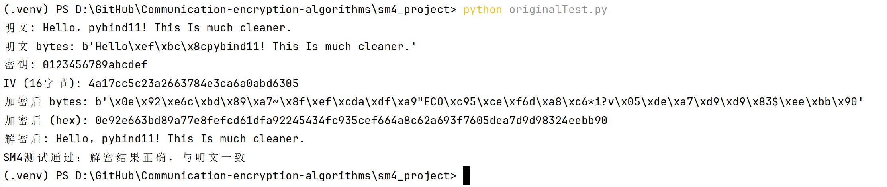

## 主文件：SM4_Encryptor.py

### 前言

调SM4底层库实现了一些函数，但说实话感觉好像也就只写了一个函数，这么看应该还是很少。

但是我问ai的意思是说底层的部分如果要自己实现不仅安全性不行而且很复杂，细节后面再看吧

采用了CTR方法，说是最常用性能最高的，实则代码写起来却是最少的

### 说明
#### 1.api文档说明

##### 1.1 def __init__(self, key: bytes, iv: bytes)

- 初始化加密解密器

- 参数
  - `key`：字节流，长度必须为 16 字节（128 位），用于加解密的密钥。
  - `iv`：字节流，长度必须为 16 字节，初始化向量（建议每次会话随机生成）。
- **返回值**：无（实例化对象）

##### 1.2 def encrypt(self, data: bytes) -> bytes

- **作用**：对字节流明文进行加密（CTR 模式）。
- **参数**：`data`：字节流，待加密的明文。
- **返回值**：字节流，加密后的密文（长度与`data`一致）。

##### 1.3 def decrypt(self, data: bytes) -> bytes

反过来

##### 1.4 def encrypt_string(self, text: str, encoding: str = 'utf-8') -> bytes

- **作用**：对字符串进行加密（自动转换为字节流）。
- 参数
  - `text`：字符串，待加密的明文。
  - `encoding`：字符串编码格式（默认`utf-8`），用于将字符串转换为字节流。
- **返回值**：字节流，加密后的密文。

（为什么有对字节流和字符串两种加密我也不知道，反正他这么一次说了两种()说实话我们获取的二进制文件应该是属于字符串吧）

##### 1.5 反过来

##### 1.6 def encrypt(data: bytes, key: bytes, iv: bytes) -> bytes

- **作用**：单次加密的快捷函数（内部自动创建`SM4Encryptor`实例）。
- 参数
  - `data`：字节流，待加密的明文。
  - `key`：字节流，16 字节密钥。
  - `iv`：字节流，16 字节初始化向量。
- **返回值**：字节流，加密后的密文。
- 1.7 反过来

#### 2.关于普通函数与便捷函数的必要性

两种函数形式的设计是为了适配不同的使用场景，提升开发灵活性：

- **`SM4Encryptor`类（面向对象接口）**：适合需要多次加密 / 解密的场景（如流式数据处理、长连接通信）。通过创建实例复用密钥和 IV，避免重复初始化，减少性能开销。
- **便捷函数`encrypt()`/`decrypt()`（函数式接口）**：适合单次或少量加密 / 解密操作（如临时数据加密）。无需手动创建实例，一行代码即可完成操作，简化调用流程。

#### 3.IV是什么

IV 是 **Initialization Vector（初始化向量）** 的缩写，是对称加密算法（如 SM4、AES 等）中用于增强安全性的重要参数，尤其在块加密模式（如 CTR、CBC 等）中必不可少。IV 的作用是**让相同密钥 + 相同明文在不同会话中生成不同的密文**，避免这种规律性暴露。

总而言之：在CTR中，IV 本身不敏感，不需要加密传输，但**加密方必须将 IV 传递给解密方**（否则解密会失败）。

如何使用？：随机生成，**长度必须 16 字节**，**同一密钥下 IV 不可重复**

## originalTest.py

按照你们所给的测试脚本修改了一点点，内容上只添加了随机生成IV，然后修改了导入写的代码文件

### 测试结果

### 其他两个文件

测试用文件，一个用来测试主文件函数加密算法通过率，一个测试模拟视频流双端加密解密，测试倒是都通过了
